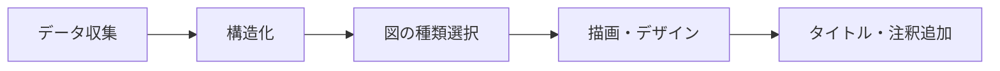

# 図・グラフ作成スキル (Visualization SKIL)

## 概要

分析結果や調査データを視覚的に伝わりやすく表現する図・グラフ・フレームワーク図を作成するスキル。コンサルティングレポート水準の構成・デザイン原則を適用する。

**参照報告書：**
- 令和5年度「我が国における生成AI基盤モデル開発の加速化に向けた調査」管理番号：000644（Boston Consulting Group 作成）
- 令和5年度「産業サイバーセキュリティ強靭化事業（サイバーセキュリティ産業の振興に関する調査）」管理番号：000408

---

## 適用場面

- 数値比較を一目で伝えたい場合（棒グラフ・バブルチャート）
- 時系列の変化を示したい場合（折れ線グラフ・面グラフ）
- 構造・関係性を整理したい場合（フレームワーク図・マトリクス）
- 国別・地域別の比較を行う場合（ヒートマップ・地図）
- プロセス・フローを示したい場合（フロー図）

---

## 図の種類と使い分け

| 目的 | 推奨する図の種類 | 例（参照報告書より） |
|------|----------------|-------------------|
| 規模・シェア比較 | 棒グラフ / 円グラフ | 各国AI投資額比較 |
| 成長トレンド | 折れ線グラフ | 生成AI基盤モデル開発件数推移 |
| 位置づけ・マッピング | 2×2マトリクス / ポジショニングマップ | 技術成熟度 × 市場規模 |
| プレイヤー整理 | バリューチェーン図 / エコシステム図 | AI産業エコシステム |
| 政策比較 | 比較表 / ヒートマップ | 各国AI支援政策一覧 |
| プロセス説明 | フロー図 / スイムレーン図 | サイバーセキュリティ対応プロセス |

---

## 実行ステップ

### Step 1：メッセージを先に定義する
- 図で伝えたい「1つの主張（So What）」を1文で書く
- 例：「日本の生成AI投資額は米中と比較して大幅に少ない」

### Step 2：最適な図の種類を選択する
- 上記の使い分け表を参照する
- 1枚の図に詰め込みすぎない（情報は最大5〜7要素まで）

### Step 3：Mermaid / テキスト形式で図を構成する


### Step 4：タイトル・ラベル・注釈を追加する
- タイトル：「何を示す図か」を明確に（動詞を含む）
- 軸ラベル：単位を必ず記載
- 注釈：出典・調査期間・定義を図の下部に記載

---

## デザイン原則（BCGレポート準拠）

1. **1スライド1メッセージ**：タイトルだけで主張が伝わるようにする
2. **余白を大切に**：情報過多を避け、視線の流れを設計する
3. **色は3色以内**：強調色1色 + モノトーン2色が基本
4. **数字は大きく**：重要な数値は文字サイズを大きく目立たせる

---

## 出力フォーマット

```
【図のタイトル（So Whatを含む）】
【図の種類】
【図本体（Mermaid or ASCII or 表形式）】
【出典・注釈】
```

---

## 注意事項

- グラフの軸を0から始めないと誇張になる（棒グラフは必ず0始まり）
- 色のみで情報を区別しない（色覚多様性への配慮）
- 3D グラフは視覚的に誤解を生むため使用しない
